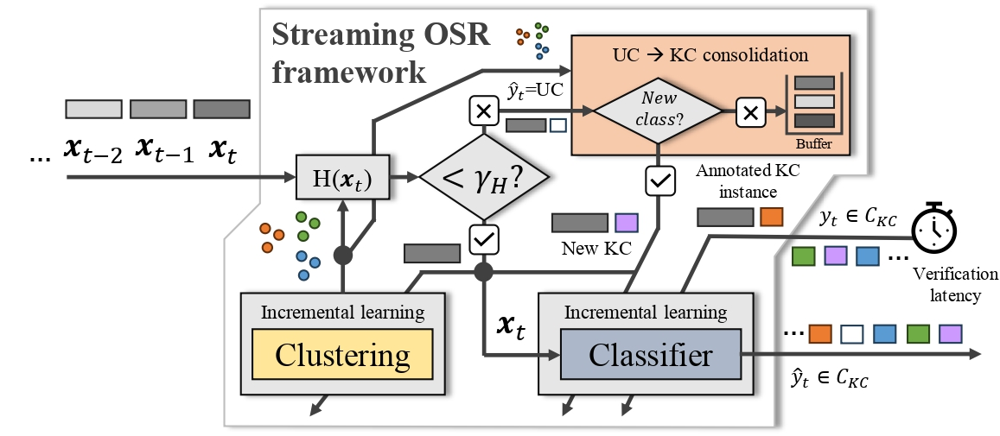

# Resilience to the flowing unknown: an Open Set Recognition Framework for Data Streams

## Abstract
Contemporary digital applications extensively integrate Artificial Intelligence (AI) models into their core systems, 
offering significant advantages for automated decision-making. 
Despite these benefits, AI-based systems face reliability and safety challenges when dealing with continuously generated data streams in complex and dynamic scenarios. 
This study delves into the concept of resilient AI systems, aiming to function effectively in the presence of unexpected events, 
including instances that deviate from patterns encountered during the training process.
The challenge addressed here is common in streaming scenarios for regular closed-set classifiers, 
which are forced to classify new observations into one of the training patterns, leading to the so-called *over-occupied space* problem. 
In the realm of batch learning, the Open Set Recognition (OSR) research area has consistently tackled this issue by demanding 
models to maintain robust classification performance even when processing query instances from unknown patterns.
Within this context, our work explores the application of an OSR framework that integrates classification and clustering to mitigate the over-occupied space problem in streaming scenarios. 
We systematically devise a benchmark featuring diverse classification datasets with different ratios of known to unknown classes. 
The experiments conducted on this benchmark compare the performance of our proposed hybrid framework with that of individual incremental classifiers. 
Discussions based on the results obtained highlight instances where the proposed framework excels, while also outlining the limitations and challenges faced by incremental classifiers in effectively addressing the complexities of open-world streaming environments.
## Keywords
resilient AI, open set recognition, unknown classes, streaming, over-occupied space

## Datasets
The files `isogauss_params.py` and `hypercube_params.py` define the parameters that are used for creating the datasets and 
running the experiments. Each list contains the values of a parameter for the creation of each dataset.
* n_samples: number of samples.
* center_classes: number of classes.
* features: number of features.
* cluster_std: intra-cluster standard deviation.
* class_sep: factor multiplying the hypercube size.
* rand_state: random number generation for dataset creation.

The values in each list correspond in order to the dataset number. Each value can be removed, added or changed in order to 
modify the number of datasets and their parameters. The last 2 variables do not affect datasets, they instead modify the
experiments themselves.
* mc: values of missing classes *β*. All the metrics of all approaches are calculated for each one.
* p_u_s: percentage of instances to use during testing from each UC.


## Experiments and evaluation
The experiments can be run for each type of datasets with the following commands:

IsoGauss datasets experiments:
```console
python isogauss_tests.py --model linear
```
HyperCube datasets experiments:
```console
python hypercube_tests.py --model linear
```
Insects datasets experiments:
```console
python insects_tests.py --model linear
```
Covert datasets experiments:
```console
python covert_tests.py --model linear
```

The `model` argument can be swapped between `linear` and `tree` for Softmax or HoeffdingTree classification respectively.
For example, for HoeffdingTree classification:
```console
python isogauss_tests.py --model tree
```
After finishing, a .txt file will be generated containing a table with the results of each metric (Acc, K-Acc, U-Acc, 
N-Acc, F1, AUC, DB index) for each approach (*static*, *incremental* and *sOSR*) of the corresponding dataset. Each
generated file also contains 2 additional tables with the *p-values* from a non-parametric Wilcoxon signed-rank test,
performed between the *static* and *sOSR* baselines and the *incremental* and *sOSR* baselines.